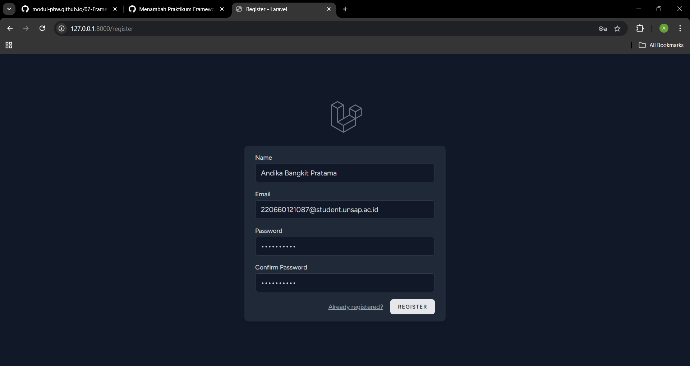
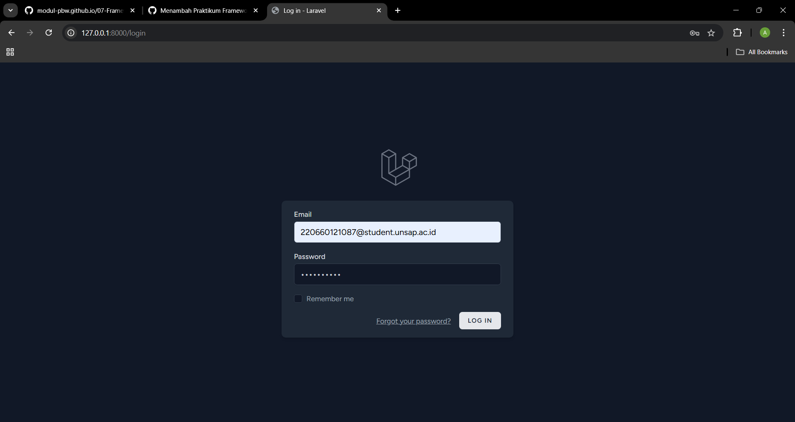
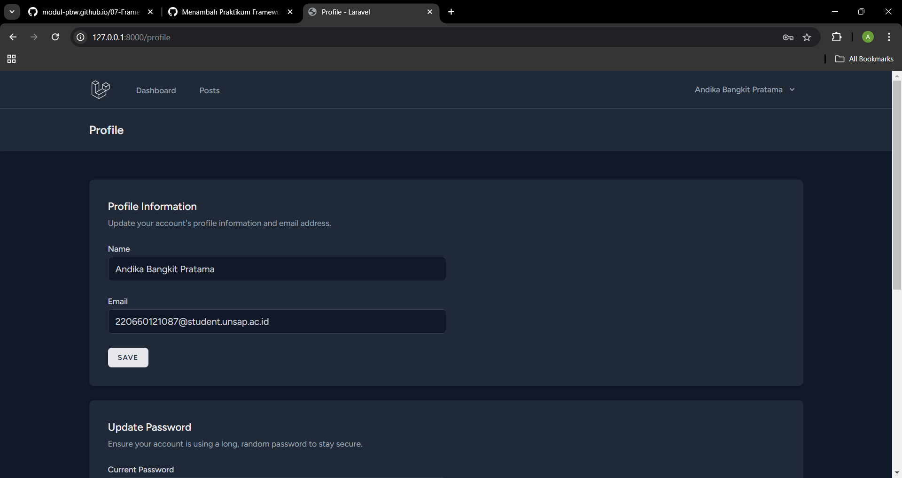
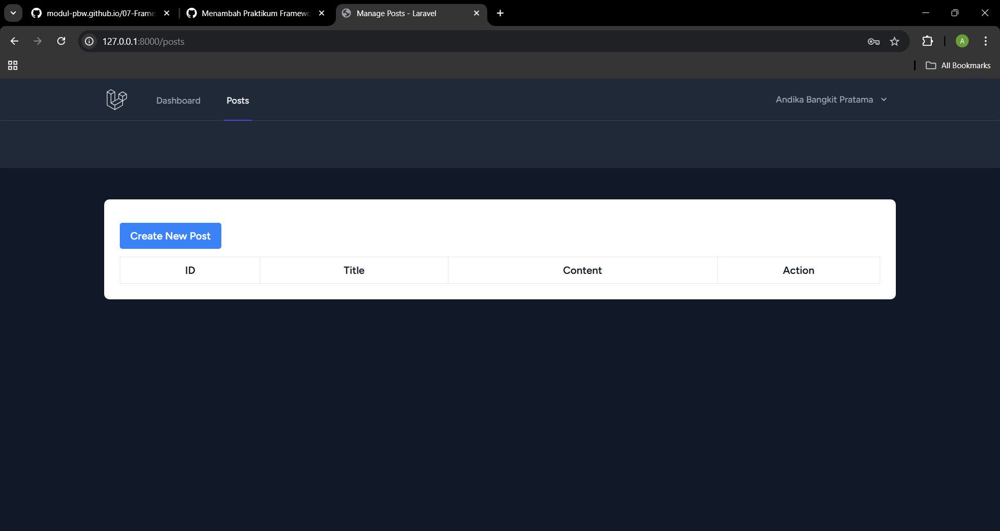

# Projek Laravel Frame
## Hasil Testing

Disini saya telah melakukan testing dan berhasil.

## Tampilan awal web

Disini saya mengakses projek laravel saya dengan menggunakan aplikasi VS.code, mengakses terminal dengan perintah "php artisan test" dan akan menerima akses url "http://127.0.0.1:8000/"

## Dashboard, Login, dan Register

- Dibagian register anda akan membuat akun terlebih dahulu
- Di Login, anda sudah memiliki akun dan,
- Anda bisa mengakses aplikasi setelah aplikasi menampilkan Dasboard

## Profil

Di bagian ini, anda dapat melihat profil anda dan bisa mengedit.

## Post
